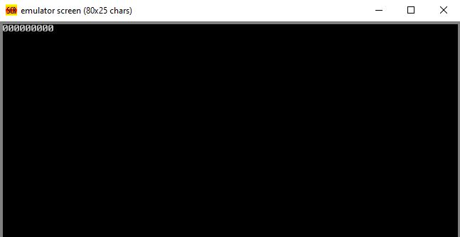

# Output

---
<h1>Green University of Bangladesh </h1>

<h2>Dept. of Computer Science Engineering</h2>

Course Title: Microprocessor and Microcontroller Lab

Course Code: CSE-304

Lab Report

Software name: EMU8086 version 4.08

Include all EMU8086 file

---

 Experiment Name: Program to find the sum of two numbers
---

---

Experiment Name: Write a program to subtract two decimal numbers
---

---

Experiment Name: Program to display the largest number using jump condition
---

---

Experiment Name: Display numbers from 1 to 7 in reverse using loop condition
---

---

Experiment Name: Writing a program to display zero 9 times using the array condition
---

---

Experiment Name: Writing a program to display string and number using the Procedure
---

---

Experiment Name: Write a program to display any number of digits using macro condition
---

---

<h1 id="test-title">Lab Report in PDF</h1>

<object data="loremipsum.pdf#page=2" type="application/pdf" width="700px" height="700px">
    <embed src="loremipsum.pdf#page=2">
        
Click here for Lab Report: <a href="Lab_Report.pdf">Download PDF</a>.

    </embed>
</object>

---

<!-- all link is here -->

### Contact me:

[E-mail](tanvirpoly@gmail.com)

[Linkedin]( https://www.linkedin.com/in/tanvirx/)

[Facebook]( https://www.facebook.com/tanvirfbid)

